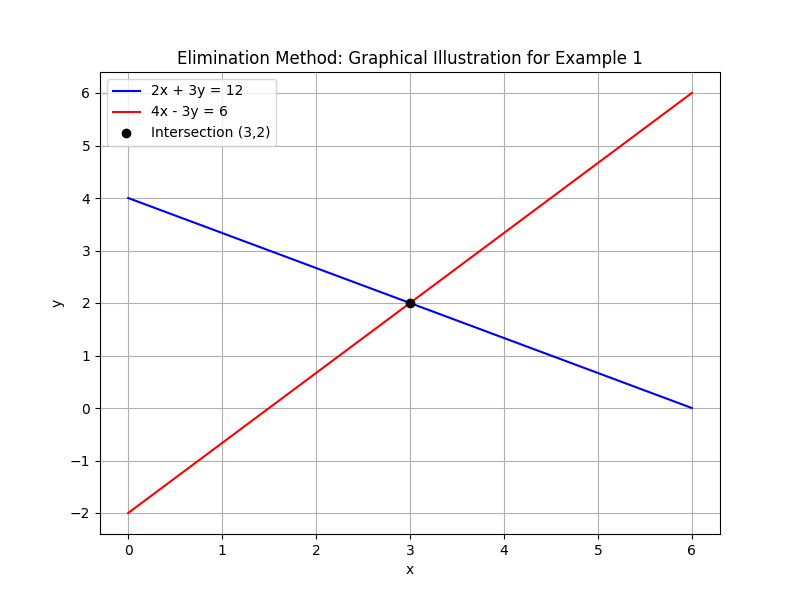

## Solving Systems of Linear Equations by Elimination

The elimination method is a systematic approach for solving a system of linear equations by removing one variable. This method relies on aligning the coefficients of a variable so that it cancels out when the equations are added or subtracted. Removing a variable simplifies the system into a single equation, which is easier to solve. This approach is particularly useful when the coefficients can be manipulated into opposites.

### Steps of the Elimination Method

1. Write the system in standard form so that the variables are aligned:

$$
ax + by = c
$$

2. Multiply one or both equations by a constant to make the coefficients of one variable equal and opposite.

3. Add or subtract the equations to eliminate that variable.

4. Solve the resulting equation for the remaining variable.

5. Substitute the found value back into one of the original equations to solve for the eliminated variable.

This method reduces a two-variable problem into a one-variable problem, simplifying the solution process.

### Example 1: A Simple Case

Consider the system:

$$
2x + 3y = 12
$$

$$
4x - 3y = 6
$$

**Step 1:** Notice that the coefficients of $y$ are $3$ and $-3$. Adding the equations will cancel out the $y$ terms.

**Step 2:** Add the two equations:

$$
(2x + 3y) + (4x - 3y) = 12 + 6
$$

This simplifies to:

$$
6x = 18
$$

**Step 3:** Divide by $6$ to solve for $x$:

$$
x = 3
$$

**Step 4:** Substitute $x = 3$ back into the first equation to solve for $y$:

$$
2(3) + 3y = 12
$$

Simplify:

$$
6 + 3y = 12
$$

Subtract $6$:

$$
3y = 6
$$

Divide by $3$:

$$
y = 2
$$

Thus, the solution is $x = 3$ and $y = 2$. By eliminating $y$, the problem was reduced to a single equation in $x$, which was then solved and substituted back to retrieve $y$.

### Example 2: Elimination with Multiplication

Consider the system:

$$
3x + 4y = 10
$$

$$
5x - 2y = 8
$$

**Step 1:** To eliminate $y$, adjust the coefficients so they are opposites. Multiply the second equation by $2$ to change $-2y$ to $-4y$:

$$
2(5x - 2y) = 2(8)
$$

This yields:

$$
10x - 4y = 16
$$

**Step 2:** Add this new equation to the first equation:

$$
(3x + 4y) + (10x - 4y) = 10 + 16
$$

The $y$ terms cancel:

$$
13x = 26
$$

**Step 3:** Divide by $13$ to find $x$:

$$
x = 2
$$

**Step 4:** Substitute $x = 2$ into the first original equation to solve for $y$:

$$
3(2) + 4y = 10
$$

Simplify:

$$
6 + 4y = 10
$$

Subtract $6$:

$$
4y = 4
$$

Divide by $4$:

$$
y = 1
$$

Thus, the solution to this system is $x = 2$ and $y = 1$.

### Real-World Application: Financial Planning

The elimination method is also useful in financial planning. Suppose you have two types of expenses, with costs of $a$ dollars per unit and $b$ dollars per unit. One spending scenario is modeled by:

$$
a_1x + b_1y = S_1
$$

and a second scenario is given by:

$$
a_2x + b_2y = S_2
$$

Using the elimination method, you can determine the number of units (represented by $x$ and $y$) for each expense category required to meet your spending goals. This approach is valuable when balancing expenses in budget planning.

### Key Concept

> The elimination method simplifies a system by strategically canceling out one variable, reducing a complex problem into a more manageable one.

Using elimination helps to reveal the direct relationship between variables and offers a clear path to the solution. Practice these steps with various systems of equations to build intuition and strengthen your problem-solving skills for the College Algebra CLEP exam.