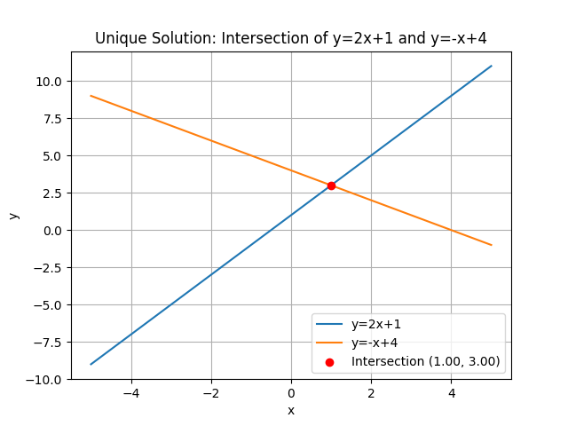
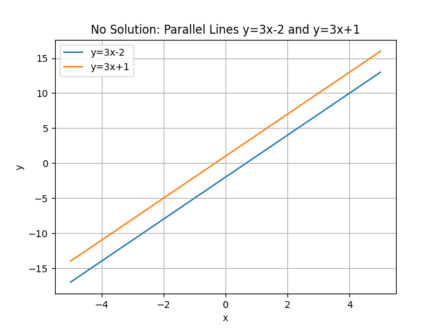
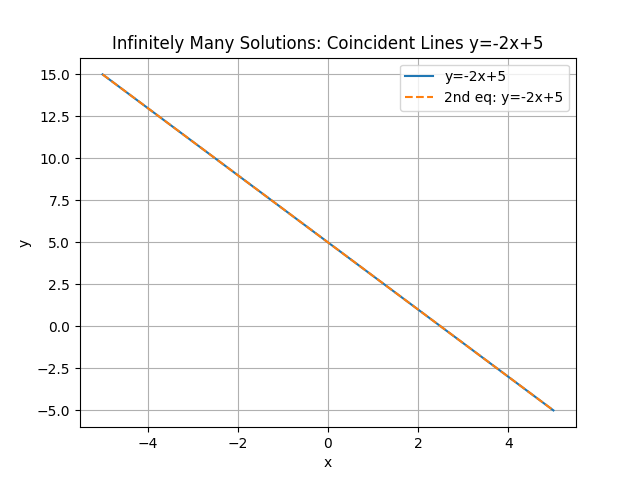

## Graphical Interpretation of Systems of Equations

A system of equations is a set of two or more equations that share the same variables. In the graphical approach, each equation is represented by a line on a coordinate plane. The solution to the system is the point (or points) where the graphs intersect. If they cross at exactly one point, there is a unique solution; if they never meet, there is no solution; and if they lie exactly on top of each other, there are infinitely many solutions.

### Key Concepts

- **Line Equation:** A linear equation in slope-intercept form is written as
$$
y = mx + b,
$$
where $m$ is the slope and $b$ is the $y$-intercept. This format clearly shows how fast the line rises or falls and where it starts on the $y$-axis.

- **Slope:** The slope represents the steepness of the line. It is calculated as the change in $y$ divided by the change in $x$. A positive slope means the line rises as $x$ increases, while a negative slope means it falls. This concept helps you predict the behavior of the graph.

- **Y-Intercept:** The $y$-intercept is the point where the line crosses the $y$-axis (when $x=0$). It indicates the starting value of the function.

### Graphing Each Equation

To graph each equation in a system, follow these steps:

1. **Find the $y$-Intercept:** Set $x=0$ to determine where the line crosses the $y$-axis.

2. **Determine the Slope:** Use the slope to calculate a second point. For example, if $m=2$, then for every increase of $1$ in $x$, the value of $y$ increases by $2$.

3. **Draw the Line:** Plot the $y$-intercept and the additional point, then draw a straight line through them. This line represents all solutions to that equation.

### Example 1: Unique Solution

Consider the system:

$$
\begin{aligned}
 y &= 2x + 1, \\
 y &= -x + 4.
\end{aligned}
$$

**Step 1:** Graph the equation
$$
y = 2x + 1.
$$

- The $y$-intercept is at $(0,1)$.
- The slope is $2$, meaning that for every increase of $1$ in $x$, $y$ increases by $2$.
- Choosing $x=1$, we calculate $y = 2(1) + 1 = 3$, so a second point is $(1,3)$.

**Step 2:** Graph the equation
$$
y = -x + 4.
$$

- The $y$-intercept is at $(0,4)$.
- The slope is $-1$, meaning that for every increase of $1$ in $x$, $y$ decreases by $1$.
- Choosing $x=1$, we find $y = -1 + 4 = 3$, so another point is $(1,3)$.

**Step 3:** Identify the Intersection

Both lines pass through the point $(1,3)$, which is the unique solution to the system. This shows that the two equations have exactly one solution in common.

Below is a graphical illustration:

<!-- tikzpicture -->

This example reinforces that when the graphs of two linear equations intersect at a single point, that point is the unique solution satisfying both equations.

### Example 2: No Solution (Parallel Lines)

Consider the system:

$$
\begin{aligned}
 y &= 3x - 2, \\
 y &= 3x + 1.
\end{aligned}
$$

Both equations have the same slope ($3$) but different $y$-intercepts. This means the lines are parallel and they never meet. The lack of an intersection indicates that the system has no solution.

### Example 3: Infinitely Many Solutions (Coincident Lines)

Consider the system:

$$
\begin{aligned}
 y &= -2x + 5, \\
 2y &= -4x + 10.
\end{aligned}
$$

The second equation simplifies to
$$
y = -2x + 5.
$$

Since both equations are identical, every point on the line is a solution. This is an example of coincident lines, meaning the system has infinitely many solutions.

### Real-World Application

Systems of equations are practical tools for modeling situations where multiple conditions must be true at the same time. For example:

- In business, the intersection of supply and demand curves determines the equilibrium price and quantity.
- In engineering, intersections of force equations help in analyzing structural balance.
- In sports analytics, intersecting performance trends can indicate a point of balance in player statistics.

Graphical analysis builds intuition by visually demonstrating how different relationships interact. Understanding these intersections is crucial for solving real-world problems and mastering the College Algebra CLEP exam material.

By mastering the graphical interpretation of systems of equations, you enhance your ability to visualize and solve problems that involve multiple constraints, paving the way for success in both academic and practical applications.