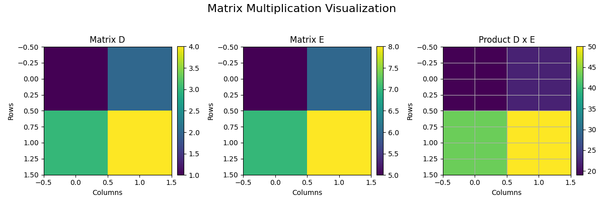

## Introduction to Matrices and Basic Matrix Operations

Matrices are rectangular arrays of numbers arranged in rows and columns. They are used to organize data and perform calculations in many areas, including finance, engineering, and computer science.

> A matrix is a compact way to represent and manipulate sets of data.

### Matrix Notation and Structure

A matrix with $m$ rows and $n$ columns is written as

$$
A = \begin{pmatrix}
a_{11} & a_{12} & \cdots & a_{1n} \\
a_{21} & a_{22} & \cdots & a_{2n} \\
\vdots & \vdots & \ddots & \vdots \\
a_{m1} & a_{m2} & \cdots & a_{mn}
\end{pmatrix}
$$

Each number $a_{ij}$ is called an element, where $i$ identifies the row and $j$ the column.

### Matrix Addition and Subtraction

Matrix addition (and subtraction) is performed by adding (or subtracting) corresponding elements. Matrices must be the same size to be added.

For example, let

$$
A = \begin{pmatrix} 2 & 5 \\ 3 & 4 \end{pmatrix} \quad \text{and} \quad B = \begin{pmatrix} 1 & -2 \\ 0 & 3 \end{pmatrix}.
$$

Then, the sum $A+B$ is computed as

$$
A+B = \begin{pmatrix} 2+1 & 5+(-2) \\ 3+0 & 4+3 \end{pmatrix} = \begin{pmatrix} 3 & 3 \\ 3 & 7 \end{pmatrix}.
$$

### Scalar Multiplication

Scalar multiplication involves multiplying every element of a matrix by a constant number.

For example, if $k=3$ and

$$
C = \begin{pmatrix} 4 & -1 \\ 2 & 6 \end{pmatrix},
$$

then

$$
kC = \begin{pmatrix} 3\times4 & 3\times(-1) \\ 3\times2 & 3\times6 \end{pmatrix} = \begin{pmatrix} 12 & -3 \\ 6 & 18 \end{pmatrix}.
$$

### Matrix Multiplication

Matrix multiplication is defined when the number of columns in the first matrix matches the number of rows in the second matrix. The element in the $i$th row and $j$th column of the product is the dot product of the $i$th row of the first matrix and the $j$th column of the second matrix.

For example, let

$$
D = \begin{pmatrix} 1 & 2 \\ 3 & 4 \end{pmatrix} \quad \text{and} \quad E = \begin{pmatrix} 5 & 6 \\ 7 & 8 \end{pmatrix}.
$$

The product $DE$ is computed as follows:

$$
DE = \begin{pmatrix}
(1\times5 + 2\times7) & (1\times6 + 2\times8) \\
(3\times5 + 4\times7) & (3\times6 + 4\times8)
\end{pmatrix} = \begin{pmatrix}
19 & 22 \\
43 & 50
\end{pmatrix}.
$$

Each entry is computed by multiplying the corresponding elements and summing the products.

### Real-World Applications

Matrices are used in various real-world scenarios:

- In finance, matrices can represent and analyze investment portfolios or model cash flows.
- In engineering, matrices model forces and transformations in structures.
- In computer graphics, they transform coordinates for rendering images.

Understanding these operations is essential for solving systems of equations, optimizing problems, and analyzing data in many fields.

By mastering these basic matrix operations, learners build a solid foundation for more advanced topics such as determinants, inverses, and solving systems using matrix methods.