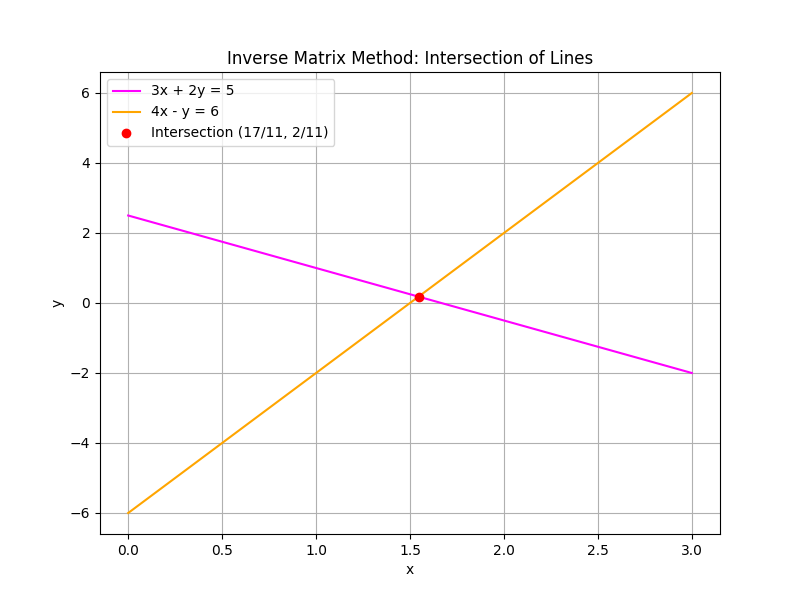
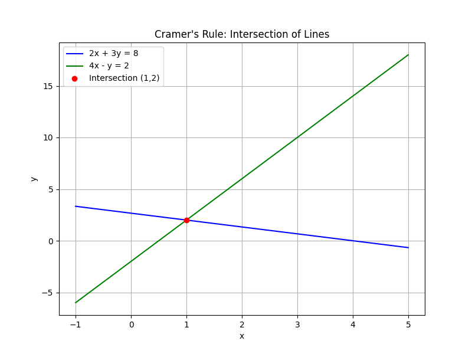

## Using Determinants and Inverse Matrices to Solve Systems

In this lesson, we will learn how to solve systems of linear equations using determinants and inverse matrices. We cover two methods:

- Using determinants with Cramer’s Rule.
- Using the inverse of a coefficient matrix.

Both methods apply to systems written in the form

$$
\begin{aligned}
ax + by &= e, \\
cx + dy &= f.
\end{aligned}
$$

A fundamental requirement is that the coefficient matrix has a non-zero determinant. This condition guarantees that the system has a unique solution.

---

### Method 1: Solving with Determinants (Cramer’s Rule)

Cramer’s Rule is a method that uses determinants to solve for each variable in a system. It is especially useful for small systems and provides insight into how the coefficients and constants interact. The basic steps are as follows:

1. **Write the system in standard form.**

2. **Form the coefficient matrix:**

$$
A = \begin{pmatrix}
a & b \\
c & d
\end{pmatrix}.
$$

3. **Compute the determinant of $A$:**

$$
D = ad - bc.
$$

   The determinant $D$ measures the area scaled by the transformation represented by $A$. A non-zero $D$ indicates that the matrix is invertible and the system has a unique solution.

4. **Replace the appropriate column with the constants to form new matrices:**

   For $x$, replace the first column with the constants:

   $$
   D_x = \begin{vmatrix}
   e & b \\
   f & d
   \end{vmatrix} = ed - bf.
   $$

   For $y$, replace the second column with the constants:

   $$
   D_y = \begin{vmatrix}
   a & e \\
   c & f
   \end{vmatrix} = af - ec.
   $$

5. **Solve for $x$ and $y$ using the formulas:**

$$
x = \frac{D_x}{D}, \quad y = \frac{D_y}{D}.
$$

These steps break the solution process into manageable parts, allowing you to see exactly how the constants and coefficients interact in determining the solution.

#### Example: Using Cramer’s Rule

Solve the system:

$$
\begin{aligned}
2x + 3y &= 8, \\
4x - y &= 2.
\end{aligned}
$$

**Step 1:** Identify the coefficients and constants:

- $a = 2$, $b = 3$, $e = 8$.
- $c = 4$, $d = -1$, $f = 2$.

**Step 2:** Form the coefficient matrix and compute its determinant:

$$
A = \begin{pmatrix}
2 & 3 \\
4 & -1
\end{pmatrix}, \quad D = (2)(-1) - (3)(4) = -2 - 12 = -14.
$$

**Step 3:** Form the matrices for $x$ and $y$:

For $x$, replace the first column with the constants:

$$
D_x = \begin{vmatrix}
8 & 3 \\
2 & -1
\end{vmatrix} = (8)(-1) - (3)(2) = -8 - 6 = -14.
$$

For $y$, replace the second column with the constants:

$$
D_y = \begin{vmatrix}
2 & 8 \\
4 & 2
\end{vmatrix} = (2)(2) - (8)(4) = 4 - 32 = -28.
$$

**Step 4:** Compute the solutions:

$$
x = \frac{-14}{-14} = 1, \quad y = \frac{-28}{-14} = 2.
$$

Thus, the solution to the system is $x = 1$ and $y = 2$.

---

### Method 2: Solving with Inverse Matrices

When the coefficient matrix is invertible (its determinant is non-zero), we can solve the system by finding the inverse of the matrix. This method offers a compact way to solve for all variables simultaneously and is useful in more advanced applications where the entire solution vector is needed.

Steps for this method:

1. **Write the system in matrix form:**

$$
A\,\mathbf{x} = \mathbf{b},
$$

where

$$
A = \begin{pmatrix}
a & b \\
c & d
\end{pmatrix}, \quad \mathbf{x} = \begin{pmatrix} x \\
 y \end{pmatrix}, \quad \mathbf{b} = \begin{pmatrix} e \\
 f \end{pmatrix}.
$$

2. **Find the inverse of the coefficient matrix:**

For a $2 \times 2$ matrix, the inverse is given by

$$
A^{-1} = \frac{1}{ad - bc}\begin{pmatrix}
d & -b \\
-c & a
\end{pmatrix}.
$$

3. **Multiply the inverse matrix by the constant vector:**

$$
\mathbf{x} = A^{-1}\,\mathbf{b}.
$$

This multiplication yields the solution vector containing both $x$ and $y$.

#### Example: Using the Inverse Matrix Method

Solve the system:

$$
\begin{aligned}
3x + 2y &= 5, \\
4x - y &= 6.
\end{aligned}
$$

**Step 1:** Write the coefficient matrix and constant vector:

$$
A = \begin{pmatrix}
3 & 2 \\
4 & -1
\end{pmatrix}, \quad \mathbf{b} = \begin{pmatrix} 5 \\
6 \end{pmatrix}.
$$

**Step 2:** Compute the determinant of $A$:

$$
D = (3)(-1) - (2)(4) = -3 - 8 = -11.
$$

Since $D \neq 0$, the matrix $A$ is invertible.

**Step 3:** Find the inverse of $A$:

$$
A^{-1} = \frac{1}{-11}\begin{pmatrix}
-1 & -2 \\
-4 & 3
\end{pmatrix}.
$$

**Step 4:** Multiply $A^{-1}$ by $\mathbf{b}$:

$$
\begin{aligned}
\mathbf{x} &= A^{-1}\,\mathbf{b} \\
&= \frac{1}{-11}\begin{pmatrix}
-1 & -2 \\
-4 & 3
\end{pmatrix}\begin{pmatrix} 5 \\
6 \end{pmatrix} \\
&= \frac{1}{-11}\begin{pmatrix}
(-1)(5) + (-2)(6) \\
(-4)(5) + 3(6)
\end{pmatrix} \\
&= \frac{1}{-11}\begin{pmatrix}
-5 - 12 \\
-20 + 18
\end{pmatrix} \\
&= \frac{1}{-11}\begin{pmatrix}
-17 \\
-2
\end{pmatrix} \\
&= \begin{pmatrix}
\frac{17}{11} \\
\frac{2}{11}
\end{pmatrix}.
\end{aligned}
$$

Thus, the solution is $x = \frac{17}{11}$ and $y = \frac{2}{11}$.

---

Both methods are valuable tools when the coefficient matrix has a non-zero determinant. Use Cramer’s Rule for quick computation of individual variables in smaller systems, and the inverse matrix method when you require the full solution vector.

Always verify that the determinant is non-zero. This check confirms that the system has a unique solution and that the methods are applicable.

