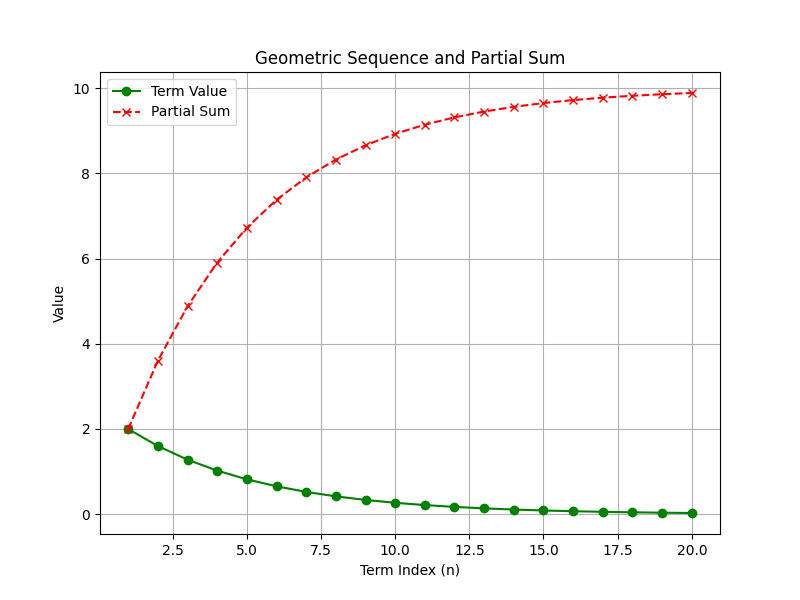
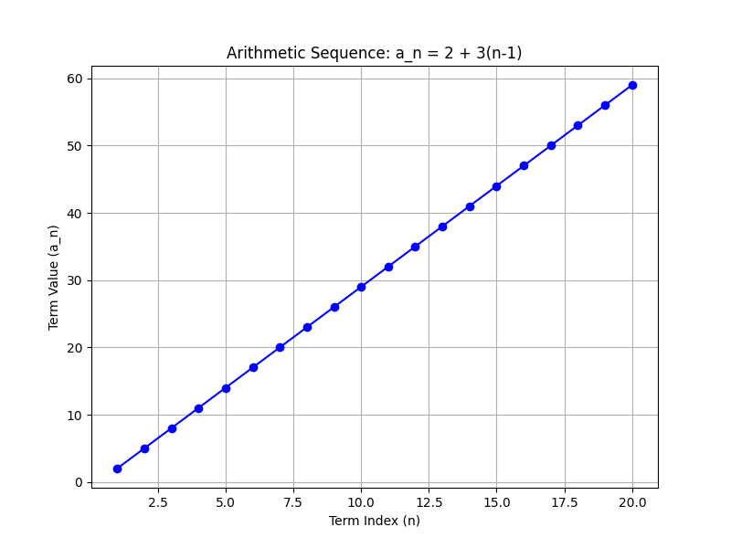

# Sequences, Series, and Advanced Topics

This unit introduces sequences and series and explains advanced topics related to them. A sequence is an ordered list of numbers, and a series is the sum of the numbers in a sequence. The unit covers both arithmetic sequences, where each term increases by a constant difference, and geometric sequences, where each term is multiplied by a constant ratio.

Understanding these concepts is important because they allow you to model real-world processes such as computing interest, analyzing population growth, and understanding patterns in data sets. Through clear, step-by-step examples, you will learn how to identify the patterns in sequences, derive formulas for the nth term, and calculate the sum of series. These methods are essential for solving complex problems and will directly support your preparation for the College Algebra CLEP exam.

For instance, in an arithmetic sequence each term differs from the previous one by a constant amount, which makes it simple to predict future terms. In a geometric sequence, on the other hand, the multiplication by a fixed ratio can describe exponential behavior such as growth or decay. These fundamental concepts have applications in finance, engineering, and scientific analysis.

In this unit, you will encounter detailed explanations and problem-solving steps that build a strong foundation in advanced algebraic methods. Each example is structured to help you develop a deeper intuition about how sequences and series operate and how these ideas can be applied to everyday challenges.

> Sequences trace the heartbeat of mathematics—each term a step in an endless journey—while series weave these beats into a tapestry of infinite discovery.

Be prepared to engage with detailed examples, clear explanations, and structured problem-solving steps that connect abstract concepts to practical applications.