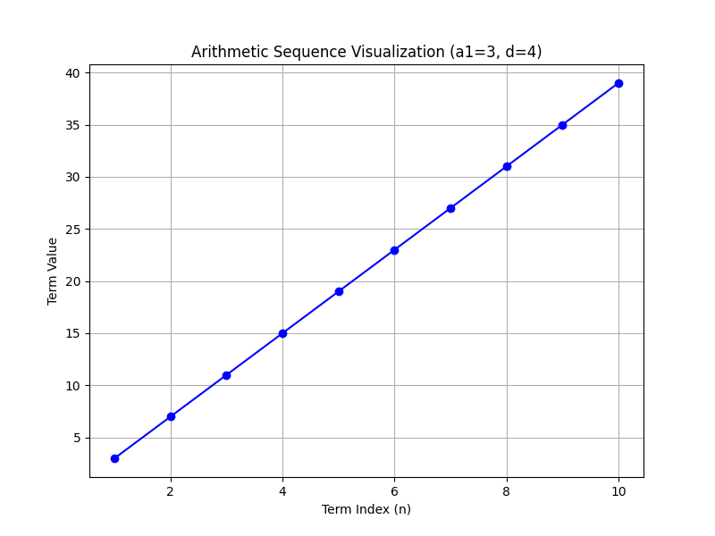

## Finding the Sum of Arithmetic Series

An arithmetic series is the sum of the terms in an arithmetic sequence. In such a sequence, each term increases or decreases by a constant value called the common difference, denoted as $d$. Understanding how to find the sum of these sequences is important because it allows you to quickly compute the total without adding each term one by one.

There are two key formulas for finding the sum of the first $n$ terms of an arithmetic sequence. Both forms are equivalent but useful in different situations.

### Key Formulas

1. **Using the first and last term:**

$$
S_n = \frac{n}{2}(a_1 + a_n)
$$

This formula is useful when you know the first term $a_1$ and the last term $a_n$. It works because the average of the first and last terms, multiplied by the number of terms, gives the total sum.

2. **Using the first term and the common difference:**

$$
S_n = \frac{n}{2}(2a_1 + (n-1)d)
$$

This version is advantageous when the last term is not immediately known. It uses the fact that the $n$th term can be computed from the first term and the common difference.

In both formulas, $n$ represents the number of terms in the series.

### Step-by-Step Example 1

**Problem:** Find the sum of the arithmetic series: $3,\; 7,\; 11,\; \ldots,\; 39$.

1. **Identify the First Term and Common Difference**

   The first term is $a_1 = 3$. To determine the common difference, subtract the first term from the second term:

   $$
d = 7 - 3 = 4
   $$

   This means that each term increases by $4$.

2. **Determine the Number of Terms ($n$)**

   Use the formula for the $n$th term of an arithmetic sequence:

   $$
a_n = a_1 + (n-1)d
   $$

   Here, $a_n = 39$. Substitute the known values into the equation:

   $$
39 = 3 + (n-1)\times 4
   $$

   Start by subtracting $3$ from both sides:

   $$
36 = 4(n-1)
   $$

   Then divide by $4$:

   $$
9 = n - 1
   $$

   Finally, solve for $n$:

   $$
n = 10
   $$

   There are $10$ terms in the series.

3. **Calculate the Sum**

   Now use the sum formula that employs the first and last term:

   $$
S_n = \frac{n}{2}(a_1 + a_n) = \frac{10}{2}(3 + 39) = 5 \times 42 = 210
   $$

   Therefore, the sum of the arithmetic series is $210$.

The step-by-step process highlights the importance of identifying key components: the first term, common difference, and number of terms. These are essential for finding the sum quickly and accurately.

### Step-by-Step Example 2: Real-World Application

**Problem:** Imagine you are planning a series of payments where the first payment is $100$, and each subsequent payment increases by $25$. If you plan to make $12$ payments, what is the total amount paid?

1. **Identify the First Term and Common Difference**

   The first payment is $a_1 = 100$, and the common difference is $d = 25$, meaning each payment is $25$ more than the one before.

2. **Find the Last Payment**

   Use the formula for the $n$th term:

   $$
a_n = a_1 + (n-1)d = 100 + (12-1) \times 25
   $$

   Simplify the expression:

   $$
a_n = 100 + 275 = 375
   $$

   So, the final payment is $375$.

3. **Compute the Total Amount**

   Apply the sum formula with the first and last payments:

   $$
S_n = \frac{12}{2}(100 + 375) = 6 \times 475 = 2850
   $$

   Thus, the total amount paid over the $12$ payments is $2850$.

In this example, the arithmetic series formula simplifies the process of adding a sequence of incrementally increasing payments, saving time and reducing potential errors.

### Understanding the Process

> In an arithmetic series, properly identifying the first term, common difference, and the number of terms is vital. This ensures that you can select and apply the appropriate sum formula effectively.

These methods allow you to quickly compute sums by leveraging the structured nature of arithmetic sequences. This is particularly useful in real-world situations such as budgeting, financial analysis, and inventory control where recurring, uniform changes are common.

### Additional Insight

The formula

$$
S_n = \frac{n}{2}(a_1 + a_n)
$$

is often preferred when both the first and last terms are known, providing a direct way to calculate the sum. Conversely, the alternative formula

$$
S_n = \frac{n}{2}(2a_1 + (n-1)d)
$$

is beneficial when the last term is not given explicitly. Both formulas yield the same result and offer flexibility based on the information available.

By mastering and applying these formulas, you develop a key algebraic skill that will be invaluable in tackling various problems on the CLEP exam and in real-life applications.