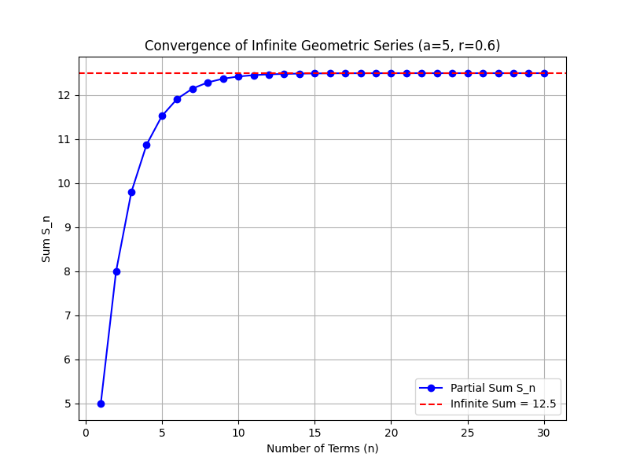
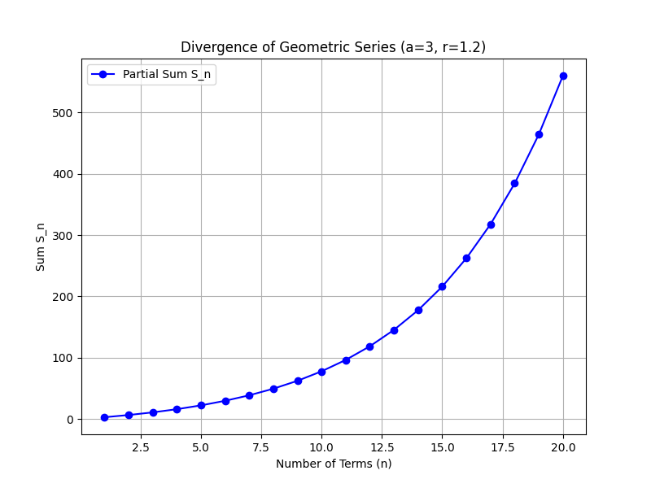

## Sum of Geometric Series and Tests for Convergence

A geometric series is a sum of terms where each term is obtained by multiplying the previous term by a constant called the common ratio. In this lesson, we explain how to find the sum of both finite and infinite geometric series and the tests used to determine convergence.

### Definition of a Geometric Series

A geometric series has the form:

$$
a + ar + ar^2 + ar^3 + \cdots + ar^{n-1}
$$

where:

- $a$ is the first term,
- $r$ is the common ratio, and
- $n$ is the number of terms in a finite series.

### Sum of a Finite Geometric Series

For a finite geometric series, the sum is found using the formula:

$$
S_n = a \cdot \frac{1 - r^n}{1 - r} \quad \text{(for } r \neq 1\text{)}
$$

**Example 1:**

Find the sum of the finite geometric series with $a = 2$, $r = 3$, and $n = 4$.

Step 1: Write out the series:

$$
2 + 2 \cdot 3 + 2 \cdot 3^2 + 2 \cdot 3^3
$$

Step 2: Use the sum formula:

$$
S_4 = 2 \cdot \frac{1 - 3^4}{1 - 3} = 2 \cdot \frac{1 - 81}{1 - 3}
$$

Step 3: Simplify the expression:

$$
S_4 = 2 \cdot \frac{-80}{-2} = 2 \cdot 40 = 80
$$

Thus, the sum of the series is $80$.

### Sum of an Infinite Geometric Series

An infinite geometric series continues without end. It is written as:

$$
a + ar + ar^2 + ar^3 + \cdots
$$

The sum of an infinite geometric series is given by:

$$
S_{\infty} = \frac{a}{1 - r} \quad \text{if } |r| < 1
$$

This formula is valid only when the common ratio satisfies $|r| < 1$. When $|r| \geq 1$, the series does not converge (it does not approach a fixed value).

**Example 2:**

Find the sum of the infinite geometric series with $a = 5$ and $r = 0.6$.

Step 1: Verify the convergence condition. Since $|0.6| < 1$, the series converges.

Step 2: Apply the sum formula:

$$
S_{\infty} = \frac{5}{1 - 0.6} = \frac{5}{0.4} = 12.5
$$

So, the sum of the infinite series is $12.5$.

### Tests for Convergence of Geometric Series

A geometric series converges if and only if the absolute value of the common ratio is less than 1:

$$
|r| < 1
$$

If $|r| \geq 1$, the infinite series diverges because the terms do not approach zero and the sum grows without bound.

**Example 3:**

Determine whether the series with $a = 3$ and $r = 1.2$ converges or diverges.

Step 1: Check the common ratio:

$$
|1.2| = 1.2 \quad \text{(which is greater than 1)}
$$

Step 2: Since $|r| \geq 1$, the infinite series diverges. No finite sum is possible.

### Convergence Using the Ratio Test

While the convergence of a geometric series is directly determined by $|r|$, the ratio test is a general tool for series. For any series, the ratio test compares the limit of the absolute value of the ratio of consecutive terms. In a geometric series, this ratio is constant and equals $|r|$. Therefore, the ratio test confirms convergence when:

$$
|r| < 1
$$

and divergence when:

$$
|r| \geq 1
$$

### Real-World Applications

Geometric series appear in various real-world contexts:

- **Finance:** Calculating the future value of an investment with compound interest.
- **Engineering:** Modeling signal attenuation where a signal decreases by a constant ratio with each successive stage.
- **Gaming Statistics:** Estimating the diminishing returns on repeated actions or rewards.

### Summary Steps

1. Identify the first term $a$ and common ratio $r$ of the series.
2. For a finite series with $n$ terms, use:

   $$
   S_n = a \cdot \frac{1 - r^n}{1 - r}
   $$

3. For an infinite series, ensure $|r| < 1$ before applying:

   $$
   S_{\infty} = \frac{a}{1 - r}
   $$

4. If $|r| \geq 1$, recognize that the series does not converge.

This lesson has outlined the essential formulas and tests required to work with geometric series, preparing you to apply these concepts in a variety of real-life problem-solving scenarios.