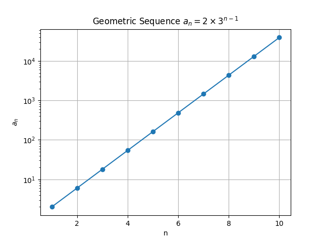
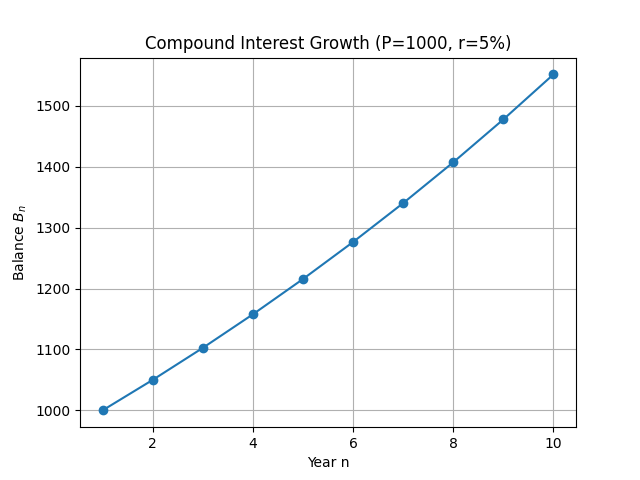

## Exploring Recursive Sequences and Formula Derivation

A recursive sequence is defined by its first term (or terms) and a rule that describes how to obtain each subsequent term from the previous one. In many cases, it is helpful to derive an explicit formula (a formula for the $n$th term) that allows you to calculate any term directly without computing all the preceding terms.

### Understanding Recursive Sequences

A recursive sequence has two main parts:

1. **Initial Term(s):** The starting value(s) needed to begin the sequence.
2. **Recursive Rule:** A formula that expresses each term in terms of previous term(s).

For example, consider a sequence with the initial term $a_1$ and a rule such as:

$$
a_n = a_{n-1} + d
$$

This is the pattern for an arithmetic sequence, where $d$ is a constant difference. Intuitively, you can imagine starting at a point and then moving a fixed distance each time, which builds the sequence step by step.

> A recursive sequence emphasizes the process of building each term one step at a time.

### Method for Deriving an Explicit Formula

Deriving an explicit formula makes it easier to compute any term in the sequence without finding all the previous ones. Follow these steps:

1. **Write out the first few terms.**

   Listing several terms helps reveal the hidden pattern in the sequence.

2. **Identify the pattern.**

   Look for constant differences (which indicate an arithmetic sequence) or constant ratios (which indicate a geometric sequence). Recognizing the pattern is the key to generalization.

3. **Express the $n$th term in terms of the first term.**

   Use the detected pattern to create a formula that represents the growth of the sequence. This explicit formula allows direct computation for any value of $n$.

### Example 1: An Arithmetic Sequence

Consider the recursive sequence defined by:

$$
a_1 = 3, \quad a_n = a_{n-1} + 4 \quad \text{for } n \geq 2.
$$

**Step 1: Write out the first few terms.**

- $a_1 = 3$
- $a_2 = 3 + 4 = 7$
- $a_3 = 7 + 4 = 11$
- $a_4 = 11 + 4 = 15$

Writing the terms shows how the sequence builds incrementally.

**Step 2: Identify the pattern.**

Each term increases by the constant $4$, indicating that the sequence is arithmetic. The fixed increment simplifies the prediction of future terms.

**Step 3: Derive the explicit formula.**

The general formula for the $n$th term of an arithmetic sequence is:

$$
a_n = a_1 + (n-1)d
$$

Substitute $a_1 = 3$ and $d = 4$:

$$
a_n = 3 + (n-1) \times 4
$$

This explicit formula allows you to compute any term without repeating all previous calculations.

### Example 2: A Geometric Sequence

Now consider a sequence defined by:

$$
a_1 = 2, \quad a_n = 3 \times a_{n-1} \quad \text{for } n \geq 2.
$$

**Step 1: Write out the first few terms.**

- $a_1 = 2$
- $a_2 = 3 \times 2 = 6$
- $a_3 = 3 \times 6 = 18$
- $a_4 = 3 \times 18 = 54$

By listing the terms, you can see that each term is derived by multiplying the previous term by $3$.

**Step 2: Identify the pattern.**

Each term is obtained by multiplying the previous term by the constant $3$. This characteristic multiplication shows that the sequence is geometric.

**Step 3: Derive the explicit formula.**

For a geometric sequence, the $n$th term is given by:

$$
a_n = a_1 \times r^{(n-1)}
$$

Here, $a_1 = 2$ and the common ratio $r = 3$. Thus, the explicit formula is:

$$
a_n = 2 \times 3^{(n-1)}
$$

This form quickly provides the value for any term in the sequence.

### Real-World Application

Recursive sequences and their explicit formulas appear in many practical scenarios. A common example is in finance:

- **Compound Interest:** Suppose you deposit an amount of money in a bank account that earns a fixed interest rate. The account balance each year can be modeled recursively, with each term representing the balance after one compounding period.

For a deposit of $P$ dollars and an annual interest rate $r$, the recursive formula is:

$$
B_1 = P, \quad B_n = B_{n-1} \times (1+r)
$$

The explicit formula becomes:

$$
B_n = P \times (1+r)^{(n-1)}
$$

This formula allows you to compute the account balance after any number of years directly, making it a powerful tool in understanding compound growth.

### Visualizing the Sequences

A visual representation can help solidify your understanding of how these sequences progress. Consider the following plot of the arithmetic sequence from Example 1:

<!-- tikzpicture -->

This plot clearly illustrates how the arithmetic sequence grows by a constant amount with each term. Visual aids like this help build intuition for how sequences progress.

### Key Takeaways

- A recursive sequence is defined by an initial term and a rule for finding subsequent terms.

- To derive an explicit formula, first write out several terms to recognize a pattern such as a constant difference in arithmetic sequences or a constant ratio in geometric sequences.

- Once the pattern is identified, the explicit formula allows you to compute any term directly, greatly simplifying calculations.

- These concepts have practical applications, for example, in calculating compound interest in financial models. By understanding these methods, you gain a powerful toolset for solving a wide range of problems in College Algebra.