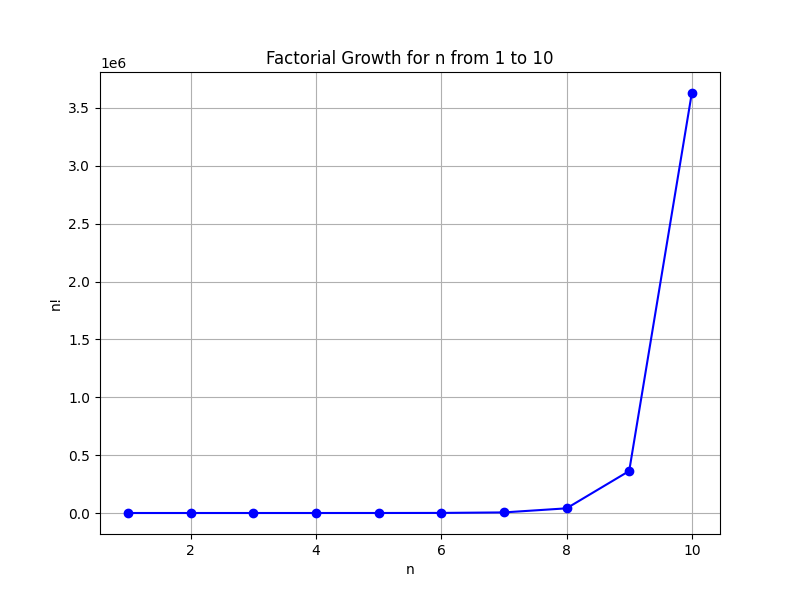
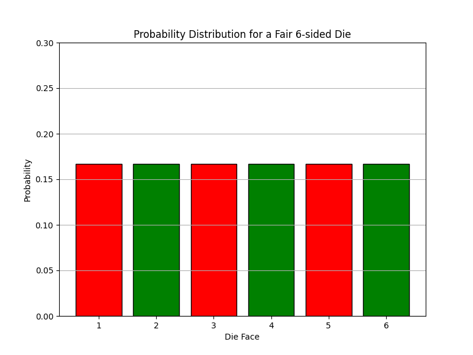

## Introduction to Combinatorics and Basic Probability

This lesson introduces the basic ideas of combinatorics and probability. You will learn methods to count objects efficiently and calculate simple probabilities. These skills are essential tools in decision making, gaming statistics, finance, engineering, and other real-world applications.

### Combinatorial Counting

Combinatorics is the branch of mathematics that deals with counting objects without listing each possibility one by one. It provides systematic techniques to count when the order of items matters (permutations) or does not matter (combinations). Understanding these methods builds intuitive problem-solving skills useful for analyzing complex situations.

#### The Multiplication Principle

If one event can occur in $m$ ways and a second event can occur in $n$ ways, then the total number of outcomes for both events is given by

$$
Total = m \times n
$$

For example, if you have 3 shirts and 2 pairs of pants, you form complete outfits by choosing one shirt and one pair of pants. The total number of outfits is $3 \times 2 = 6$. This simple rule applies to many everyday decisions where multiple independent choices are made in sequence.

#### Factorial

A factorial, denoted by $n!$, is the product of all positive integers up to $n$. It is defined as:

$$
n! = n \times (n-1) \times \cdots \times 2 \times 1
$$

For instance,

$$
5! = 5 \times 4 \times 3 \times 2 \times 1 = 120
$$

Factorials are essential when calculating arrangements and permutations because they count the number of ways to order a set of items.

#### Permutations (Order Matters)

Permutations determine the number of ways to arrange a set of objects when the order is important. The formula for the number of permutations when selecting $r$ objects from a total of $n$ is:

$$
P(n, r) = \frac{n!}{(n - r)!}
$$

*Example:* Imagine you want to arrange 3 books out of 5 on a shelf. The calculation is as follows:

$$
P(5, 3) = \frac{5!}{(5 - 3)!} = \frac{120}{2!} = \frac{120}{2} = 60
$$

There are 60 different ways to arrange these 3 books. This method is practical in scenarios like scheduling, seating arrangements, or ordering tasks where sequence matters.

#### Combinations (Order Does Not Matter)

Combinations count the number of ways to select items when the order does not matter. The formula is:

$$
C(n, r) = \frac{n!}{r!(n - r)!}
$$

*Example:* Suppose you need to choose 3 team members from a group of 5. The computation is:

$$
C(5, 3) = \frac{5!}{3!(5-3)!} = \frac{120}{6 \times 2} = \frac{120}{12} = 10
$$

There are 10 different ways to choose the team members. This example illustrates how combinations help in selecting groups where order is irrelevant, such as picking a committee or selecting lottery numbers.

### Basic Probability

Probability measures the likelihood of an event occurring. It is defined as the ratio of the number of favorable outcomes to the total number of outcomes. The probability value ranges from 0 to 1, where 0 indicates impossibility and 1 indicates certainty.

$$
Probability = \frac{\text{Number of favorable outcomes}}{\text{Total number of outcomes}}
$$

This concept is crucial for risk assessment, decision making, and understanding randomness in various fields.

#### Example: Rolling a Die

Consider a fair 6-sided die. To find the probability of rolling an even number, follow these steps:

1. List the total outcomes: ${1, 2, 3, 4, 5, 6}$ (6 outcomes).
2. Identify the favorable outcomes: ${2, 4, 6}$ (3 outcomes).
3. Apply the probability formula:

$$
Probability = \frac{3}{6} = \frac{1}{2}
$$

Thus, the probability of rolling an even number is $\frac{1}{2}$. This simple example shows how probability quantifies everyday random events.

### Real-World Applications

Counting techniques and probability calculations are fundamental tools in various fields. For instance:

- **Gaming:** Calculate the odds of winning or losing based on different strategies.
- **Finance:** Estimate the likelihood of market events or risk assessments.
- **Sports Analytics:** Determine winning strategies or player selections by computing probabilities.
- **Engineering:** Assess potential risks and outcomes in design and safety evaluations.

These applications demonstrate how a solid grasp of combinatorics and probability aids in making informed decisions in practical situations.

### Step-by-Step Example: Secret Code Combinations

Imagine you are setting a lock with a 4-digit code. Each digit can be any number from 0 to 9. To count the total number of different codes possible, apply the Multiplication Principle: each digit has 10 possible outcomes.

$$
Total\;codes = 10 \times 10 \times 10 \times 10 = 10^4 = 10000
$$

Thus, there are 10,000 possible combinations for the lock. This example highlights how multiplying individual independent choices can lead to a large number of potential outcomes.

### Summary of Key Formulas

- **Multiplication Principle:** Total outcomes = $m \times n$
- **Factorial:** $n! = n \times (n-1) \times \cdots \times 1$
- **Permutations:** $P(n, r) = \frac{n!}{(n - r)!}$
- **Combinations:** $C(n, r) = \frac{n!}{r!(n - r)!}$
- **Probability:** $Probability = \frac{\text{Favorable outcomes}}{\text{Total outcomes}}$

This lesson provides foundational tools that are essential for handling real-life problems involving arrangements and uncertainty. Understanding these concepts builds a strong base for tackling advanced algebraic and probabilistic events, crucial for the College Algebra CLEP exam.