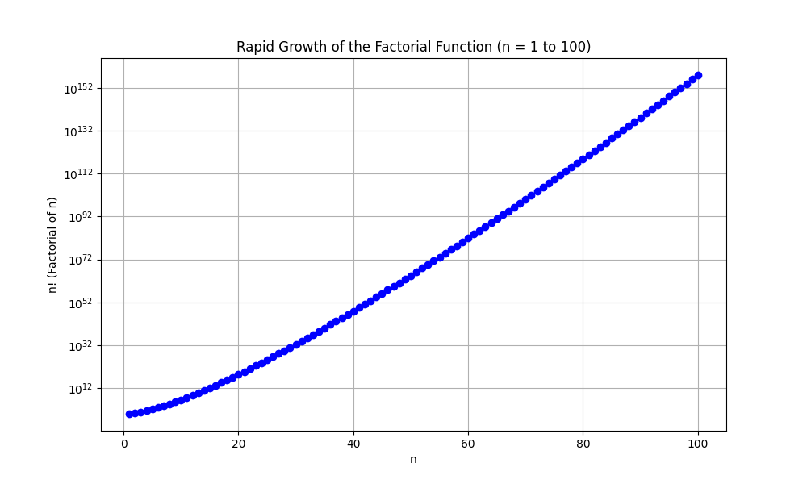

## Factorials and Binomial Theorem

This lesson explores two essential concepts in combinatorics and algebra: factorials and the Binomial Theorem. You will learn how factorials are defined and used, and then see how the Binomial Theorem utilizes factorials to expand binomials in a systematic way. These tools are critical in many areas, including probability, statistics, and various real-life applications such as calculating combinations and analyzing patterns.

### Understanding Factorials

A factorial, denoted as $n!$, is the product of all positive integers from $1$ to $n$. It is a fundamental tool for counting arrangements where the order matters. In many real-world problems, factorials reveal how quickly the number of possible outcomes increases with additional items.

By definition:

$$
n! = n \times (n-1) \times (n-2) \times \cdots \times 2 \times 1
$$

It is important to remember that by convention,

$$
0! = 1
$$

This convention supports formulas in permutations and combinations, ensuring consistency in algebraic expressions that involve factorials.

#### Example: Calculating a Factorial

Let's compute $5!$ step-by-step to understand the process:

1. Start with the highest number: $5$.
2. Multiply sequentially down to $1$:

$$
5! = 5 \times 4 \times 3 \times 2 \times 1 = 120
$$

This calculation shows that there are 120 different ways to arrange 5 distinct items in order. The process also helps you see how quickly the number of arrangements grows with larger numbers.

#### Visualizing Factorial Growth

Factorials increase very rapidly as $n$ increases. Visualizing this growth can help you understand the power of factorials. In the plot below, the horizontal axis represents $n$ and the vertical axis represents $n!$. Even small increases in $n$ lead to extremely large values of $n!$, which is why factorials are so effective in counting problems.

### The Binomial Theorem

The Binomial Theorem offers a shortcut for expanding binomials raised to a power without multiplying the binomial by itself repeatedly. It provides a formula for expressions of the form $(x+y)^n$, which is very useful in algebra, probability, and various application areas.

The formula is:

$$
(x+y)^n = \sum_{k=0}^{n} \binom{n}{k} x^{n-k} y^k
$$

Here, $\binom{n}{k}$, known as the binomial coefficient, counts the number of ways to choose $k$ items from a set of $n$. This coefficient is defined using factorials:

$$
\binom{n}{k} = \frac{n!}{k!(n-k)!}
$$

This formulation clearly links factorials to the expansion process of the Binomial Theorem and simplifies the computation significantly.

#### Step-by-Step Example: Expanding $(a+b)^4$

Follow these steps to expand $(a+b)^4$ using the Binomial Theorem:

1. Identify $n=4$.
2. Write the expansion using the theorem:

$$
(a+b)^4 = \sum_{k=0}^{4} \binom{4}{k} a^{4-k} b^k
$$

3. Compute the binomial coefficients for each term:

   - For $k=0$:

     $$
     \binom{4}{0} = \frac{4!}{0!\,4!} = 1
     $$

   - For $k=1$:

     $$
     \binom{4}{1} = \frac{4!}{1!\,3!} = \frac{24}{6} = 4
     $$

   - For $k=2$:

     $$
     \binom{4}{2} = \frac{4!}{2!\,2!} = \frac{24}{4} = 6
     $$

   - For $k=3$:

     $$
     \binom{4}{3} = \frac{4!}{3!\,1!} = 4
     $$

   - For $k=4$:

     $$
     \binom{4}{4} = \frac{4!}{4!\,0!} = 1
     $$

4. Substitute these values into the expansion:

$$
(a+b)^4 = 1\,a^4 + 4\,a^3b + 6\,a^2b^2 + 4\,ab^3 + 1\,b^4
$$

This step-by-step approach makes it clear how each term in the expansion is determined and why factorials are useful in this context.

#### Real-World Applications

Both factorials and the Binomial Theorem are used widely in real-life scenarios:

- **Statistics and Probability:** They aid in calculating combinations and permutations, helping to determine the number of possible outcomes in experiments or events.

- **Engineering:** They are used in analyzing systems where different factors combine in various ways, such as in reliability testing or network configurations.

- **Finance:** Binomial models, which derive from the Binomial Theorem, help approximate scenarios like the movement of stock prices or compound interest calculations.

### Bringing It Together

Understanding factorials lays the groundwork for more advanced algebraic methods, such as the Binomial Theorem. Together, these concepts enable you to solve complex counting and expansion problems efficiently, without resorting to manual multiplication for each term.

Consistent practice and methodical step-by-step evaluation help build intuition and mastery over these topics, ensuring a strong foundation for the College Algebra CLEP exam and beyond.