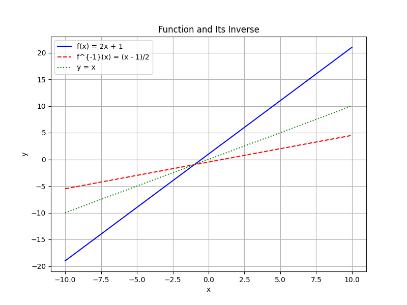

# Function Applications and Modeling

In this unit, we explore the use of functions to model real-world situations and solve applied problems. We introduce various methods to construct functions that represent everyday scenarios in fields such as finance, engineering, and science.

This unit covers:

- Developing functions from real-world data
- Interpreting and analyzing function behavior
- Applying functions to model dynamic systems
- Understanding composite and inverse functions in practical contexts

By studying these applications, you will learn why functions are a powerful tool in problem solving and decision making. They provide a systematic way to represent relationships between quantities and predict outcomes in complex scenarios. The methods discussed in this unit will enable you to construct accurate models, simulate different situations, and analyze the impact of changing variables.

> Function applications and modeling are the translators of mathematics, converting abstract symbols into maps that navigate the intricate landscapes of the real world.