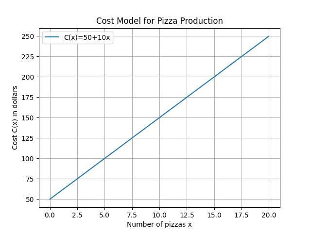
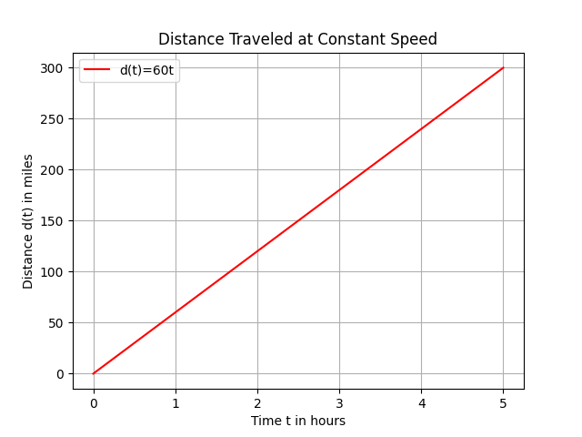

## Constructing Functions to Model Real World Scenarios

Functions are mathematical relationships that connect an input value to an output value. A function can be thought of as a machine: you provide it with an input, and it processes that input using a rule to produce an output. When creating a function to model a real situation, we identify the variable parts of the scenario, express the relationship in a clear mathematical form, and then use that expression to make predictions and analyze behavior.

### Understanding the Scenario

Before writing a function, consider the following steps carefully:

- **Identify the independent variable (input):** This is the quantity you can control or change, such as time, quantity, or number of items. It is the starting point in the process.

- **Determine the constant factors:** These are values that do not change in the situation. They might include fixed costs, base rates, or starting amounts.

- **Recognize the type of relationship:** Determine whether the relationship between the independent variable and the output is linear, quadratic, or of another form. This helps in choosing the correct model.

- **Express the situation mathematically:** Write the relationship in a clear, concise mathematical form. This step translates a real-life process into an equation.

Understanding these steps ensures you have a systematic approach to model the behavior and predictions accurately. The intuition is that every measurable process has inputs and outputs; by identifying them, you simplify complex scenarios into solvable mathematical expressions.

### Defining Variables and Building the Function

A function is often written as

$$
 f(x)=\text{expression}
$$

where $x$ is the independent variable. In real-life applications, $f(x)$ might represent cost, distance, or profit. Follow these steps to build the function:

1. **List what is known:** Write down all given values and conditions of the scenario.

2. **Assign symbols:** Choose variables to represent unknown quantities clearly.

3. **Construct the equation:** Use the known relationships to form the function. This may involve adding fixed amounts, multiplying by rates, or combining several elements of the scenario.

This methodical process helps in breaking down problems into manageable parts, ensuring that every factor affecting the outcome is accounted for.

### Example 1: Cost Model for a Pizza Restaurant

Consider a pizza restaurant with a fixed monthly rent and a variable cost per pizza made.

- Let $x$ represent the number of pizzas made in a month.

- The restaurant has a fixed rent of $50 dollars, and each pizza costs $10 dollars to produce.

The total monthly cost, represented by $C(x)$, can be modeled by the function:

$$
 C(x)=50+10x
$$

This function indicates that when no pizzas are made ($x=0$), the cost is just $50 dollars. For every pizza produced, the cost increases by $10 dollars. The model is linear, meaning the change in cost is proportional to the change in the number of pizzas.

#### Visualizing the Linear Model

The graph of the function $C(x)=50+10x$ is a straight line with a slope of $10$ and a y-intercept of $50$. The slope indicates how steep the line is – a slope of $10$ means that for every unit increase in $x$, the cost increases by $10$ dollars. The y-intercept of $50$ is the starting cost.

Consider the following sketch of a number line representing the number of pizzas:

<!-- tikzpicture -->

This number line helps you visualize how the function works over a small range of $x$ values.

### Example 2: Distance Traveled at a Constant Speed

Imagine a car moving at a constant speed. The distance traveled is directly proportional to the time spent driving. This scenario is another instance of a linear relationship.

- Let $t$ represent the time in hours.

- Suppose the car travels at a constant rate of $60$ miles per hour.

The function for the distance, $d(t)$, is:

$$
 d(t)=60t
$$

This equation shows that if the car drives for 1 hour, it covers $60$ miles; for 2 hours, it covers $120$ miles, and so forth. The constant rate (or slope) of $60$ indicates that the distance increases steadily as time increases.

### Incorporating Key Factors

When modeling real-world scenarios, additional details might need to be considered:

- **Multiple Variables:** In some situations, more than one variable affects the outcome (for example, cost may depend on both quantity and time). In these cases, you might need to create a system of functions or extend a single function to include additional terms.

- **Nonlinear Relationships:** Some changes are not proportional. For example, acceleration in physics is represented by quadratic or exponential functions. Carefully analyze the scenario to decide if a nonlinear model is more appropriate.

- **Units and Interpretation:** Always state the units clearly. In the cost model, for instance, costs are measured in dollars and the number of pizzas is a count. Correct units ensure that the model is both accurate and practical.

Including these factors gives your function greater precision and enhances its ability to model the actual scenario.

### Conclusion

By following these structured steps—identifying the independent variable, determining constants and rates, and constructing the mathematical relationship—you can create functions that effectively model a wide range of real-world scenarios. This systematic approach is essential for fields such as finance, engineering, and science, where precise predictions and analyses are needed.

Practice applying these steps using different scenarios to build a strong understanding of how functions work. This will boost your confidence and solidify your skill in constructing mathematical models for real-life problems.

