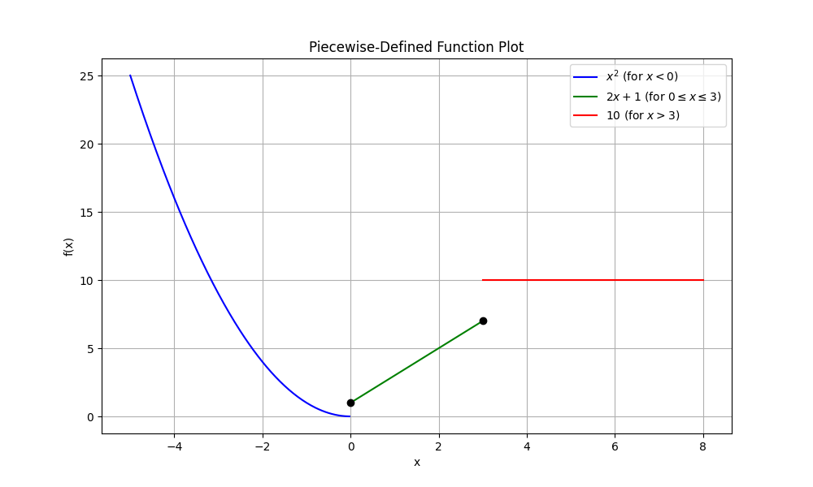

## Lesson: Working with Piecewise-Defined Functions

Piecewise-defined functions use different expressions for different parts of their domains. This lesson will explain how to evaluate and graph these functions step by step.

### Understanding Piecewise-Defined Functions
A piecewise-defined function is written with separate formulas for different intervals. For example, a function can be written as:

$$
f(x)=\begin{cases}
x^2 & \text{if } x < 0, \\
2x+1 & \text{if } 0 \le x \le 3, \\
10 & \text{if } x > 3. 
\end{cases}
$$

> A piecewise function lets you model situations where the rule changes based on the value of $x$.

### Evaluating a Piecewise Function
To evaluate a piecewise function, follow these steps:

1. **Identify the input value.**
2. **Determine which condition (interval) the input satisfies.**
3. **Substitute the value into the corresponding expression.**

#### Example 1: Evaluate $f(x)$ at Different Points
Using the function above:

$$
f(x)=\begin{cases}
x^2 & \text{if } x < 0, \\
2x+1 & \text{if } 0 \le x \le 3, \\
10 & \text{if } x > 3. 
\end{cases}
$$

- **For $x = -2$:**

  - Since $-2 < 0$, use $x^2$:

  $$
f(-2)=(-2)^2=4.
  $$

- **For $x = 0$:**

  - Here, $0$ falls in the interval $0 \le x \le 3$, so use $2x+1$:

  $$
f(0)= 2(0)+1=1.
  $$

- **For $x = 5$:**

  - Since $5 > 3$, the value is determined by the last rule:

  $$
f(5)=10.
  $$

### Graphing Piecewise Functions
Graphing a piecewise function involves plotting each piece only over its specified interval. Follow these tips:

- **Draw a number line.** Mark the boundaries where the expression changes.
- **Plot each function segment.** Only show the graph over the interval defined. Use open circles to indicate that an endpoint is not included, and closed circles when it is included.

#### Example 2: Sketching the Graph

For the function

$$
f(x)=\begin{cases}
x^2 & \text{if } x < 0, \\
2x+1 & \text{if } 0 \le x \le 3, \\
10 & \text{if } x > 3, 
\end{cases}
$$

- On the interval $x < 0$, the graph shows a parabola. For example, at $x = -2$, we have $f(-2)=4$, and at $x = -1$, $f(-1)=1$.
- From $x=0$ to $x=3$, the line $y=2x+1$ is drawn. At $x=0$, $f(0)=1$, and at $x=3$, $f(3)=7$.
- For $x > 3$, the function is constant. Draw a horizontal line starting just after $x=3$ at $y=10$.

You can visualize the different segments clearly by carefully marking the endpoints on your graph.

### Real-World Application: Shipping Costs
Consider a shipping cost model:

$$
C(w)=\begin{cases}
5 & \text{if } 0 < w \le 2, \\
5+2(w-2) & \text{if } 2 < w \le 5, \\
11+3(w-5) & \text{if } w > 5,
\end{cases}
$$

where $w$ is the weight of a package. 

- For a package weighing 1.5 units, the cost is $5$, since $w \le 2$.
- For a package weighing 3 units, use the second rule:

$$
C(3)=5+2(3-2)=5+2=7.
$$

- For a package weighing 6 units, apply the third rule:

$$
C(6)=11+3(6-5)=11+3=14.
$$

This model shows how different cost formulas apply depending on the package weight.

### Summary of Steps

- Identify the appropriate section of the piecewise function.
- Substitute the input value into the corresponding expression.
- Graph each segment on the correct interval using proper endpoints.

Understanding piecewise-defined functions is useful in many real-world scenarios. These include areas like shipping costs, tax brackets, and utility pricing models, where different conditions apply based on value ranges.