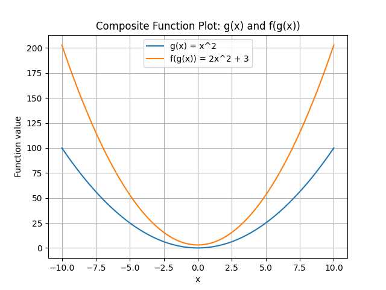
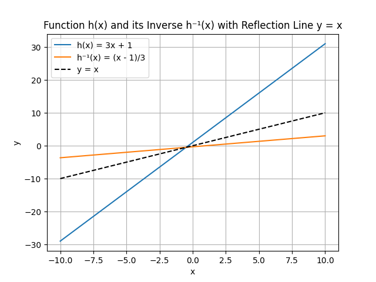

## Solving Problems Using Composite and Inverse Functions

Composite and inverse functions are powerful tools in algebra that allow you to combine and reverse operations. In this lesson, we explore how to work with these concepts step by step, using clear examples and real-life applications.

### Understanding Composite Functions

A composite function is formed when one function is applied to the result of another. If you have two functions, $f(x)$ and $g(x)$, the composite function $f(g(x))$ means you first apply $g$ to $x$ and then apply $f$ to the result.

For example, let

$$
f(x) = 2x + 3 \ 
g(x) = x^2
$$

To compute $f(g(x))$, follow these steps:

1. Compute $g(x)$.
2. Substitute the result into $f(x)$.

### Example: Evaluating a Composite Function

Suppose you want to evaluate $(f \circ g)(2)$. Follow these steps:

1. Compute $g(2)$:

$$
g(2) = 2^2 = 4
$$

2. Substitute into $f(x)$:

$$
f(4) = 2(4) + 3 = 11
$$

So, $(f \circ g)(2) = 11$.

### Understanding Inverse Functions

An inverse function reverses the effects of the original function. If $f(x)$ is a function, its inverse, denoted $f^{-1}(x)$, returns the value that was used as input for $f$.

The defining property is:

$$
f\bigl(f^{-1}(x)\bigr) = x \quad \text{and} \quad f^{-1}\bigl(f(x)\bigr) = x
$$

To find the inverse of a function, swap the roles of $x$ and $y$, and then solve for $y$.

### Example: Finding the Inverse of a Composite Function

Consider two functions:

$$
f(x) = x + 1 \ 
g(x) = 3x
$$

First, form the composite function $h(x)$:

$$
h(x) = f\bigl(g(x)\bigr) = f(3x) = 3x + 1
$$

Now, find the inverse of $h(x)$.

Step 1. Write the function with $y$:

$$
y = 3x + 1
$$

Step 2. Swap $x$ and $y$:

$$
x = 3y + 1
$$

Step 3. Solve for $y$:

Subtract 1 from both sides:

$$
x - 1 = 3y
$$

Divide both sides by 3:

$$
y = \frac{x - 1}{3}
$$

Therefore, the inverse function is

$$
h^{-1}(x) = \frac{x - 1}{3}
$$

### Real-World Application: Converting Temperature

Composite functions can model multi-step processes. For example, consider converting a temperature from Celsius to Fahrenheit after increasing the Celsius temperature by 1 degree.

Let

$$
g(x) = x + 1 \ 
f(x) = \frac{9}{5}x + 32
$$

The composite function $f(g(x))$ is:

1. Increase $x$ by 1:

$$
g(x) = x + 1
$$

2. Convert to Fahrenheit:

$$
f(g(x)) = \frac{9}{5}(x + 1) + 32
$$

If the original temperature is 20°C, then:

$$
g(20) = 20 + 1 = 21
$$

$$
f(21) = \frac{9}{5}(21) + 32 = \frac{189}{5} + 32 = 37.8 + 32 = 69.8\text{°F}
$$

This two-step process is naturally handled by a composite function.

### Summary of Steps

- To evaluate a composite function $f(g(x))$, start by calculating $g(x)$ and then evaluate $f$ at that value.
- To find an inverse function, replace $f(x)$ with $y$, swap $x$ and $y$, and solve for $y$.
- These techniques are useful in a range of real-world problems from converting units to solving equations where reversing operations is required.

By mastering composite and inverse functions, you gain tools to model and solve multi-step problems efficiently.