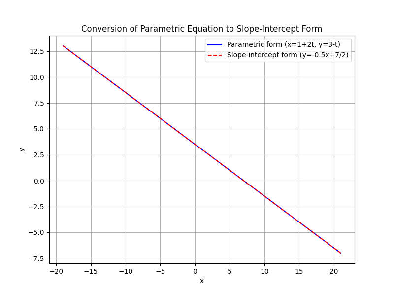
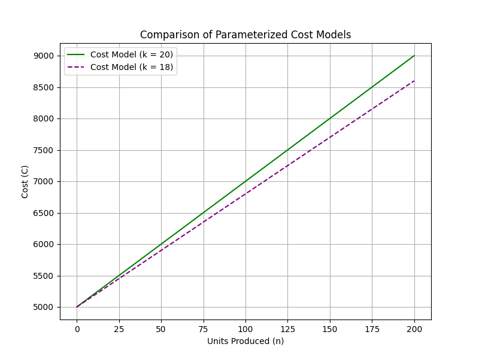

## Exploring Parameterized Equations and Models

Parameterized equations introduce one or more parameters to represent a family of related equations. In these models, a parameter is a constant whose value can be varied, allowing the equation to adapt to different scenarios. This concept is essential when modeling real-world situations where conditions change over time or across different cases.

### What Is a Parameter?

A parameter is a fixed quantity that helps define a system or an equation. Unlike variables, which can change within an equation, parameters remain constant for a given instance. Changing the value of a parameter generates different, but related, outcomes. This idea helps to capture a range of behaviors with a single, general formula.

> A parameter adjusts the model without changing its underlying structure.

### Parameterized Equations in Algebra

A parameterized equation incorporates one or more parameters along with the usual variables. For example, consider the familiar linear equation in slope-intercept form:

$$
 y = mx + b
$$

Here, $m$ and $b$ are parameters that set the slope and $y$-intercept of the line, respectively. By adjusting $m$ and $b$, you can generate different lines on a graph, each corresponding to different real-life scenarios such as trends in data or cost functions in budgeting.

Parameterized equations can also be written in a form that uses an independent parameter to describe a geometric object. For example, a line in the plane can be expressed as:

$$
 x = x_0 + at, \quad y = y_0 + bt
$$

In this representation, $(x_0, y_0)$ is a fixed point on the line, and $a$ and $b$ determine its direction. The parameter $t$ is free to take any real value, which in turn generates every point along the line. This method of writing equations emphasizes the continuous nature of many mathematical relationships.

### Example 1: Converting Parametric Equations to Slope-Intercept Form

Consider a line given in parametric form:

$$
 x = 1 + 2t \quad \text{and} \quad y = 3 - t
$$

Follow these steps to convert this parametric representation into the familiar slope-intercept form:

1. **Solve for $t$ in terms of $x$:**

   $$
    t = \frac{x - 1}{2}
   $$

   This step isolates the parameter $t$, linking it directly to the variable $x$.

2. **Substitute the expression for $t$ into the equation for $y$:**

   $$
    y = 3 - \frac{x - 1}{2}
   $$

3. **Simplify the equation:**

   Break down the terms to combine like terms:

   $$
    y = 3 - \frac{1}{2}x + \frac{1}{2} = \frac{7}{2} - \frac{1}{2}x
   $$

This rewritten equation is now in slope-intercept form:

$$
 y = -\frac{1}{2}x + \frac{7}{2}
$$

This process illustrates how eliminating the parameter $t$ produces an equation that is more immediately recognizable and easier to analyze.

### Example 2: A Real-World Parameterized Model

Consider a scenario in which a company models its overall cost $C$ based on the number of units produced, $n$. The total cost comprises a fixed cost and a variable cost per unit. This model can be expressed as:

$$
 C(n) = C_0 + kn
$$

Where:

- $C_0$ is the fixed cost, representing the initial investment.
- $k$ is the variable cost per unit, a parameter that reflects changing production efficiency or market conditions.

**Step-by-Step Analysis:**

1. **Identify the parameters in the model:**
   - For example, a fixed cost might be $C_0 = 5000$ dollars.
   - The variable cost per unit might be $k = 20$ dollars.

2. **Write the cost model with these values:**

   $$
    C(n) = 5000 + 20n
   $$

3. **Analyze the effect of changing $k$:**
   If production improvements reduce the variable cost to $18$ dollars, the model becomes:

   $$
    C(n) = 5000 + 18n
   $$

This parameterized approach allows the company to evaluate how adjustments in variable cost affect the overall expense, thus aiding in planning and decision-making in a real-world context.

### Understanding the Role of Parameters

Parameters allow us to:

- Represent families of equations using a single general formula.
- Adjust models flexibly without changing the basic relationship between variables.
- Examine how sensitive a model is to changes in conditions or inputs, which is especially useful in practical applications like budgeting or forecasting.

### Conclusion

Parameterized equations and models serve as a powerful tool in algebra by generalizing relationships through constant parameters. By systematically varying these constants, you can generate a range of specific instances to model various real-world situations, from simple linear relationships to complex cost structures. Mastery of this concept is essential not only for the College Algebra CLEP exam but also for practical decision-making and problem-solving in everyday applications.