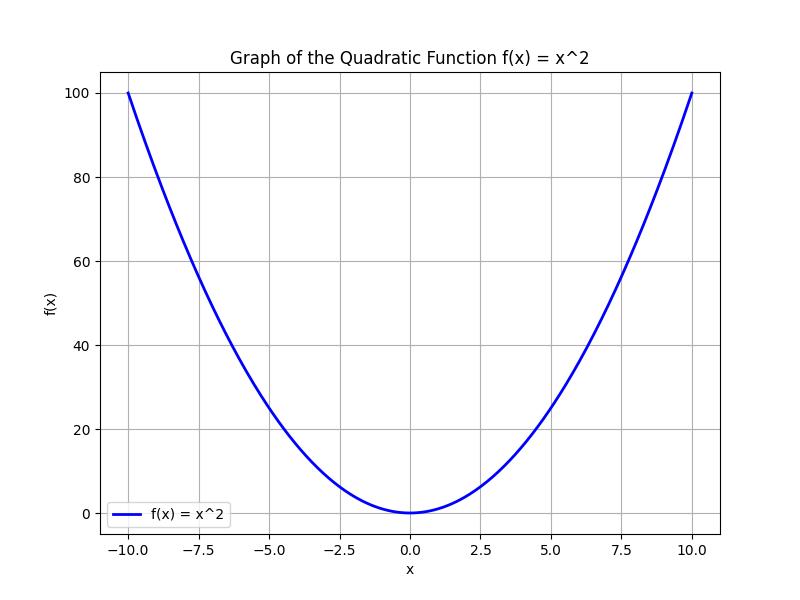

# Comprehensive Review and Challenge Problems

This unit brings together some of the algebra concepts you have mastered throughout the course. It is designed to review key topics and provide challenge problems that mirror complex, real-world scenarios.

The unit is structured around three main ideas:

What: It covers a broad range of topics, including solving equations, working with functions, graphing, and transforming expressions. You will revisit fundamental skills and integrate multiple methods to solve advanced problems.

Why: The comprehensive review and challenge problems are essential for reinforcing your understanding. They expose any gaps in knowledge while promoting critical thinking and the ability to apply algebra concepts in practical applications such as financial modeling, engineering design, and statistical analysis.

How: Each challenge problem is broken down into clear, methodical steps. Detailed explanations of each method provide intuition behind the concepts, helping you to understand not only how to solve the problem but also why each step is taken. This approach builds a strong foundation for tackling both textbook and real-life algebraic challenges.

> "Mathematics is not about numbers, equations, computations, or algorithms: it is about understanding." – William Paul Thurston
