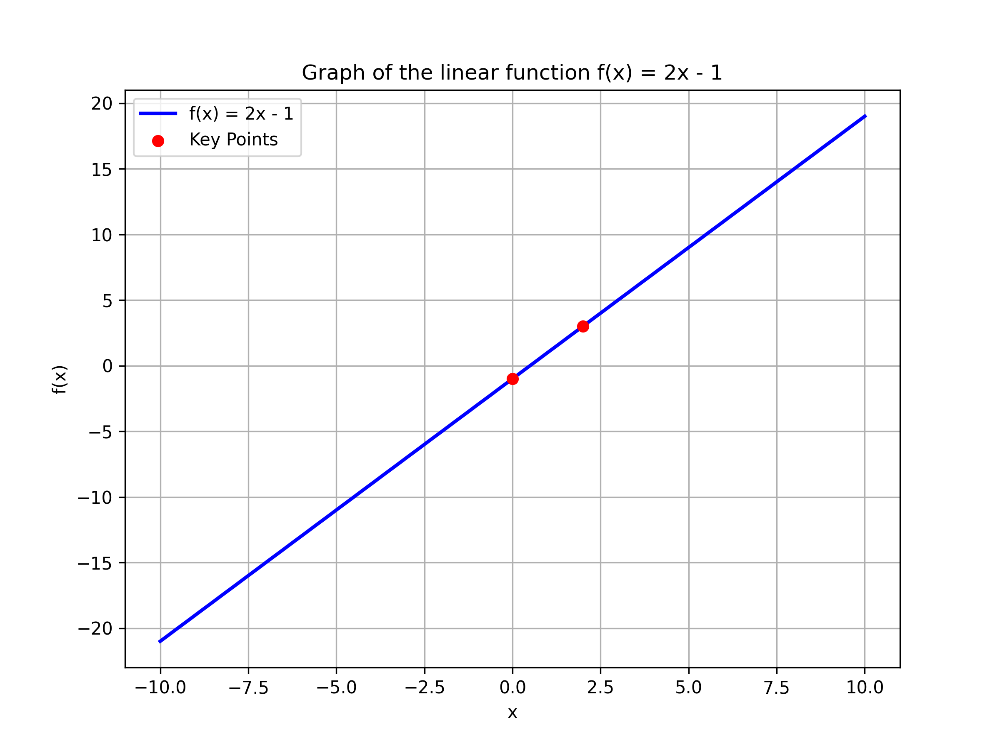

## Integrated Review of Algebraic Concepts

This lesson integrates the fundamental algebraic concepts you have studied, combining operations on expressions, solving equations, factoring, and understanding functions. Each section reviews key ideas with detailed, step-by-step examples and real-world applications.

### 1. Algebraic Expressions and Operations

Algebraic expressions include numbers, variables, and operations. Simplifying these expressions involves grouping and combining like terms. This process is vital when working with budgets, measurements, or any situation where variables represent quantities.

For example, consider the expression:

$$
3x + 4 - 2x + 5
$$

**Step 1: Group Like Terms**

Group terms with the variable $x$ together and constant terms together:

$$
(3x - 2x) + (4 + 5)
$$

This uses the commutative property of addition, which allows the reordering of terms.

**Step 2: Simplify Each Group**

Add the like terms:

$$
x + 9
$$

The simplified expression $x + 9$ shows the combined value, a technique useful in calculating total costs and aggregate values.

### 2. Solving Linear Equations

Solving linear equations means isolating the variable on one side of the equation. This method is foundational for solving problems like computing interest or balancing equations in various applications.

Consider the equation:

$$
2x + 7 = 19
$$

**Step 1: Remove the Constant Term**

Subtract $7$ from both sides to focus on the term with $x$:

$$
2x = 12
$$

**Step 2: Solve for the Variable**

Divide both sides by $2$:

$$
x = 6
$$

The solution $x = 6$ is reached by reversing the operations applied to $x$. This step-by-step reversal enhances understanding of balancing equations.

### 3. Factoring and Quadratic Equations

Factoring simplifies solving quadratic equations by expressing them as a product of binomials. This method is particularly useful in design and engineering when quadratic relationships define key measurements.

Consider the quadratic equation:

$$
x^2 + 5x + 6 = 0
$$

**Step 1: Factor the Quadratic Expression**

Find two numbers that multiply to $6$ and add to $5$. This gives:

$$
(x + 2)(x + 3) = 0
$$

Factoring breaks the quadratic into simpler expressions.

**Step 2: Set Each Factor to Zero**

Apply the zero-product property:

$$
x + 2 = 0 \quad \text{or} \quad x + 3 = 0
$$

**Step 3: Solve for $x$**

Solve each simple equation:

$$
x = -2 \quad \text{or} \quad x = -3
$$

These solutions indicate where the quadratic function crosses the $x$-axis, essential for understanding parabolic behavior.

### 4. Functions and Graph Interpretation

A function expresses the relationship between two quantities. Graphing functions helps visualize how changes in one variable affect another, a key skill in fields like statistics and engineering.

Consider the linear function:

$$
f(x) = 2x - 1
$$

To graph this function, identify key points:

- When $x = 0$, calculate $f(0) = -1$.
- When $x = 2$, calculate $f(2) = 3$.

Plot these points on a coordinate plane and draw a straight line through them. The slope, $2$, indicates the rate of change of $f(x)$ relative to $x$, a concept useful in trend analysis and comparative studies.

### 5. Integrated Problem Example

This section combines several algebra concepts to solve a practical problem. Imagine a gaming company tracking player earnings. The earnings function is given by:

$$
E(x) = 3x + 7
$$

Here, $x$ represents the number of levels completed.

**Problem:** If a player needs to earn $22, how many levels must they complete?

**Step 1: Set Up the Equation**

Set the earnings function equal to $22:

$$
3x + 7 = 22
$$

**Step 2: Isolate $x$**

Subtract $7$ from both sides:

$$
3x = 15
$$

**Step 3: Solve for $x$**

Divide both sides by $3$:

$$
x = 5
$$

Thus, the player must complete $5$ levels. This problem illustrates how combining operations on expressions and solving equations can address practical questions, such as budgeting in gaming or forecasting performance.

Reviewing these concepts enhances your problem-solving skills and prepares you for the College Algebra CLEP exam.