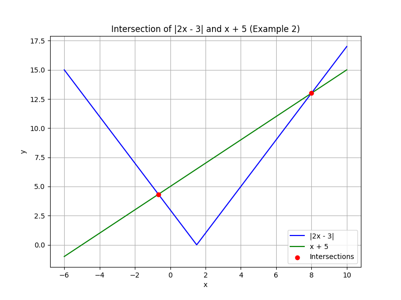
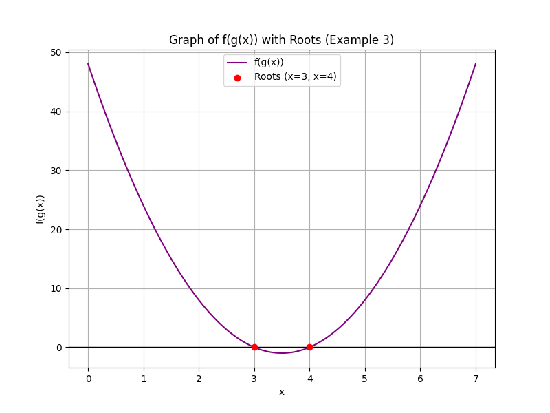

## Advanced Challenge Problems for Critical Thinking

In this lesson, we tackle advanced algebra problems that integrate several concepts. These problems require careful analysis and a methodical approach. We will work through each example step by step. Use each example to guide your problem-solving techniques and learn how to apply algebraic strategies in more challenging scenarios.

---

### Example 1: Solving a Rational Equation

Solve the equation:

$$
\frac{2}{x-1} + \frac{3}{x+2} = \frac{7}{x^2+x-2}
$$

**Step 1: Factor the Denominator**

Notice that the denominator on the right-hand side factors as:

$$
x^2+x-2 = (x-1)(x+2)
$$

So the equation becomes:

$$
\frac{2}{x-1} + \frac{3}{x+2} = \frac{7}{(x-1)(x+2)}
$$

**Step 2: Determine the Domain**

Since denominators cannot be zero, set the restrictions:

$$
x-1 \neq 0 \quad\Rightarrow\quad x \neq 1
$$

$$
x+2 \neq 0 \quad\Rightarrow\quad x \neq -2
$$

**Step 3: Clear the Fractions**

Multiply both sides by the common denominator $$(x-1)(x+2)$$:

$$
2(x+2) + 3(x-1) = 7
$$

**Step 4: Simplify and Solve**

Expand and combine like terms:

$$
2x + 4 + 3x - 3 = 7
$$

$$
5x + 1 = 7
$$

Subtract 1 from both sides:

$$
5x = 6
$$

Divide by 5:

$$
x = \frac{6}{5}
$$

**Step 5: Verify the Solution**

The value $x = \frac{6}{5}$ is valid because it does not equal 1 or -2. 

---

### Example 2: An Absolute Value Equation

Solve the equation:

$$
|2x - 3| = x + 5
$$

**Step 1: Consider the Domain**

Since the absolute value is always nonnegative, the right-hand side must also be nonnegative:

$$
x + 5 \geq 0 \quad\Rightarrow\quad x \geq -5
$$

**Step 2: Split into Cases**

The equation inside the absolute value, $2x - 3$, can be nonnegative or negative.

> **Case 1:** When $2x - 3 \geq 0$ (i.e. $x \geq \frac{3}{2}$)

In this case, the equation becomes:

$$
2x - 3 = x + 5
$$

Subtract $x$ from both sides:

$$
x - 3 = 5
$$

Add 3:

$$
x = 8
$$

Since $8 \geq \frac{3}{2}$ and $8 \geq -5$, $x = 8$ is valid.

> **Case 2:** When $2x - 3 < 0$ (i.e. $x < \frac{3}{2}$)

Now the equation becomes:

$$
-(2x - 3) = x + 5 \quad\Rightarrow\quad 3 - 2x = x + 5
$$

Add $2x$ to both sides:

$$
3 = 3x + 5
$$

Subtract 5:

$$
-2 = 3x
$$

Divide by 3:

$$
x = -\frac{2}{3}
$$

Check the condition for this case:

$$
-\frac{2}{3} < \frac{3}{2} \quad\text{and}\quad -\frac{2}{3} \geq -5
$$

Thus, $x = -\frac{2}{3}$ is valid.

**Final Answer:** The solutions are $x = 8$ and $x = -\frac{2}{3}$.

---

### Example 3: Function Composition Leading to a Quadratic Equation

Let

$$
f(x) = x^2 - 4x + 3 \quad\text{and}\quad g(x) = 2x - 5.
$$

Find all $x$ such that:

$$
f(g(x)) = 0
$$

**Step 1: Substitute $g(x)$ into $f(x)$**

Compute $f(g(x))$:

$$
f(g(x)) = (2x-5)^2 - 4(2x-5) + 3
$$

**Step 2: Expand the Expression**

First, expand $(2x - 5)^2$:

$$
(2x-5)^2 = 4x^2 - 20x + 25
$$

Then, substitute into $f(g(x))$:

$$
f(g(x)) = 4x^2 - 20x + 25 - 8x + 20 + 3
$$

Combine like terms:

$$
4x^2 - 28x + 48 = 0
$$

**Step 3: Simplify the Equation**

Divide the entire equation by 4:

$$
x^2 - 7x + 12 = 0
$$

**Step 4: Factor the Quadratic**

Factor the equation:

$$
(x - 3)(x - 4) = 0
$$

Thus, the solutions are:

$$
x = 3 \quad\text{or}\quad x = 4
$$

**Step 5: Verify by Substitution**

Substitute back into the expression for $g(x)$ if necessary. Both values yield valid outputs.

---

This lesson has presented three advanced challenge problems that blend multiple algebra concepts. Analyze each step carefully and consider these techniques as part of your problem-solving toolkit for the CLEP exam.