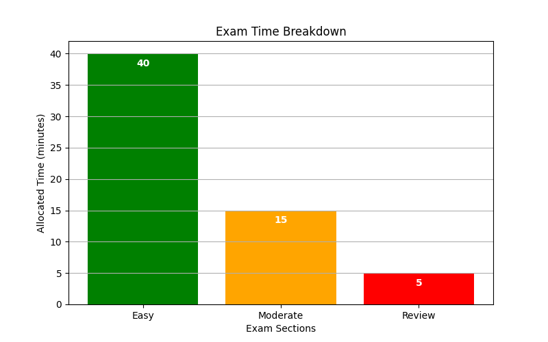

## Strategies for Test Taking and Timed Practice

This lesson focuses on developing effective strategies for managing time and stress during tests. We explore methods for pacing, careful reading, and systematic decision-making that are essential for success on the College Algebra CLEP exam.

### Understanding the Test Format

Before the exam, it is important to understand its structure. Knowing the number of problems, the total time available, and the types of questions (multiple-choice, free response, etc.) allows you to allocate your time wisely. This understanding helps you avoid surprises and allows you to plan a methodical approach during the test.

> Effective preparation begins with understanding the test format and knowing what to expect.

### Time Management Techniques

Good time management is vital. We break down the process into clear steps:

- **Calculate Time per Question:**
  First, determine the average time allocated per question. For example, if you have 60 minutes for 25 questions, calculate

  $$
  \text{Time per question} = \frac{60}{25} = 2.4 \text{ minutes}
  $$

  This average guides you in pacing yourself so that you do not spend too much time on any single problem.

- **Keep a Steady Pace:**
  Throughout the exam, check your progress. For example, if you have completed 10 questions in 20 minutes, compare this pace to the average time per question to verify that you will finish comfortably.

- **Plan for Review:**
  Reserve the last few minutes to review your answers. This extra time can help you identify and correct simple errors or misread questions.

These techniques are designed to reduce stress and help you remain focused throughout the exam.

### Reading Questions Thoroughly

It is essential to read each question carefully. This ensures you do not miss crucial instructions or keywords. Consider these strategies:

- **Highlight Key Terms:**
  Underline or mentally note important words such as "solve", "simplify", or "evaluate". These words direct you to the specific action needed.

- **Break Down the Problem:**
  If a question is complex, divide it into smaller, sequential steps. This division can clarify the problem and allow for a systematic solution approach.

Detailed reading minimizes errors and solidifies your understanding of the problem.

### Elimination Techniques

Multiple-choice questions can sometimes include clearly incorrect options. Use these strategies to narrow your choices:

- **Rule Out Extremes:**
  Remove answers that are either unreasonably high or low based on the context of the problem. Extreme values often indicate incorrect computation or misinterpretation.

- **Compare Similar Answers:**
  When options appear similar, recheck your calculations carefully. Small numerical differences require precise work and careful comparison.

Utilizing elimination strategies streamlines your decision-making process and increases your chances of selecting the correct answer.

### Practice Under Timed Conditions

Regular practice under timed conditions is key to developing exam endurance and speed:

- **Use a Timer:**
  Solve practice problems with a timer set. This practice familiarizes you with the amount of time spent on each problem and sharpens your pacing techniques.

- **Set Incremental Goals:**
  Break your practice sessions into smaller time increments. For example, target completing a batch of problems within a set time to simulate different parts of the exam.

- **Reflect on Practice Sessions:**
  After each session, take a moment to identify any delays or difficulties. Analyzing your performance helps you adjust strategies for future tests.

Timed practice builds comfort with the exam pressure and teaches you how to maintain focus over the entire duration of the test.

### Example Timed Practice Plan

Imagine an exam with 30 questions over 60 minutes. A possible strategy is as follows:

1. **First 40 Minutes:**
   Focus on the easier problems. For example, if there are 20 easy questions, allocate about 2 minutes per question to work through them quickly and accurately.

2. **Next 15 Minutes:**
   Address moderately challenging questions. If there are 5 questions here, plan to spend roughly 3 minutes per question. This slightly longer time allows you to think through more complex problems.

3. **Last 5 Minutes:**
   Use this short period to review your answers and ensure no simple mistakes were made. A quick review can catch errors that may have been overlooked during the initial solving process.

This plan can be adjusted depending on the exam’s format and the difficulty of the problems.

### Additional Tips for Success

Maintaining a clear mind and adapting strategies during the test are vital. Additional suggestions include:

- **Stay Calm:**
  Stress can impede clear thinking. If you feel overwhelmed, pause for a brief moment and take deep breaths to regain focus.

- **Skip and Return:**
  If a question is consuming too much time, mark it and move on to ensure you answer the easier questions first. Return to the skipped question if time permits.

- **Prepare Mentally:**
  Visualization techniques can be very helpful. Imagine yourself successfully working through problems with clarity and precision. This mental rehearsal improves confidence and test performance.

By incorporating these detailed strategies into your practice routine, you create a strong framework for exam success. Understanding the test format and timing, along with regular, focused practice, helps build both speed and accuracy.

