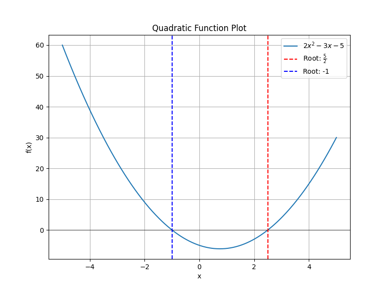
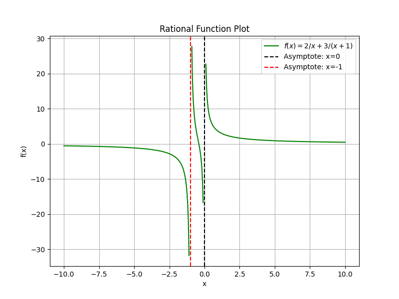

## Final Challenge Problems for College Algebra CLEP Preparation

This lesson presents a series of comprehensive challenge problems that cover various topics from college algebra. Each problem is broken down into clear, methodical steps to reinforce your understanding and prepare you for the College Algebra CLEP exam. Detailed explanations and intuitive insights are provided to help you master each concept.

### Problem 1: Solving a Quadratic Equation

Solve the quadratic equation:

$$
2x^2 - 3x - 5 = 0
$$

**Step 1: Identify Coefficients**

Write down the coefficients from the quadratic equation. In this case, 

- $a = 2$
- $b = -3$
- $c = -5$

This step sets up the problem by clearly defining the values used in the quadratic formula.

**Step 2: Write the Quadratic Formula**

The quadratic formula is given by:

$$
x = \frac{-b \pm \sqrt{b^2 - 4ac}}{2a}
$$

This formula is the standard method for solving any quadratic equation.

**Step 3: Substitute the Coefficients**

Replace $a$, $b$, and $c$ in the quadratic formula with the values identified:

$$
x = \frac{-(-3) \pm \sqrt{(-3)^2 - 4(2)(-5)}}{2(2)}
$$

This substitution incorporates the specific equation into the general formula.

**Step 4: Simplify the Expression**

First, simplify the numerator and the expression under the square root:

$$
x = \frac{3 \pm \sqrt{9 + 40}}{4}
$$

Then, combine the numbers under the square root:

$$
x = \frac{3 \pm \sqrt{49}}{4}
$$

Since $\sqrt{49} = 7$, the expression becomes:

$$
x = \frac{3 \pm 7}{4}
$$

**Step 5: Find the Two Solutions**

For the positive square root:

$$
x = \frac{3 + 7}{4} = \frac{10}{4} = \frac{5}{2}
$$

For the negative square root:

$$
x = \frac{3 - 7}{4} = \frac{-4}{4} = -1
$$

**Intuition:** The quadratic formula provides a systematic way to break down any quadratic equation into its roots. Understanding each substitution and simplification helps build a strong foundation for solving more complex equations later on.

### Problem 2: Solving a Rational Equation

Solve the rational equation:

$$
\frac{2}{x} + \frac{3}{x+1} = 1
$$

**Step 1: Identify the Common Denominator**

The least common denominator (LCD) for the fractions is $x(x+1)$. Identifying the LCD allows us to eliminate the fractions from the equation.

**Step 2: Clear the Fractions**

Multiply both sides of the equation by the common denominator $x(x+1)$:

$$
x(x+1)\left( \frac{2}{x} + \frac{3}{x+1} \right) = x(x+1)(1)
$$

Simplify each term by canceling common factors:

$$
2(x+1) + 3x = x^2 + x
$$

**Step 3: Expand and Simplify**

Expand the left side:

$$
2x + 2 + 3x = x^2 + x
$$

Combine like terms:

$$
5x + 2 = x^2 + x
$$

**Step 4: Rearrange the Equation**

Bring all terms to one side to set the equation to zero:

$$
x^2 + x - 5x - 2 = 0
$$

Simplify to obtain:

$$
x^2 - 4x - 2 = 0
$$

**Step 5: Solve the Quadratic Equation**

Use the quadratic formula with $a=1$, $b=-4$, and $c=-2$:

$$
x = \frac{-(-4) \pm \sqrt{(-4)^2 - 4(1)(-2)}}{2(1)}
$$

Simplify the equation:

$$
x = \frac{4 \pm \sqrt{16 + 8}}{2}
$$

$$
x = \frac{4 \pm \sqrt{24}}{2}
$$

Since $\sqrt{24}$ simplifies to $2\sqrt{6}$, the equation further simplifies to:

$$
x = \frac{4 \pm 2\sqrt{6}}{2} = 2 \pm \sqrt{6}
$$

**Intuition:** Rational equations require eliminating fractions to convert them into polynomials. The systematic approach of finding a common denominator and clearing fractions simplifies the process and reinforces key algebraic techniques.

### Problem 3: Solving an Exponential Equation

Solve the exponential equation:

$$
3^{2x} = 81
$$

**Step 1: Express in the Same Base**

Recognize that $81$ is a power of $3$, since $81 = 3^4$. Rewrite the equation as:

$$
3^{2x} = 3^4
$$

**Step 2: Equate the Exponents**

Since the bases are equal, set the exponents equal to each other:

$$
2x = 4
$$

**Step 3: Solve for $x$**

Divide both sides by 2:

$$
x = 2
$$

**Intuition:** Converting all terms to the same base simplifies exponential equations. This technique leverages the properties of exponents to isolate and solve for the variable efficiently.

### Problem 4: Solving a Simple Linear Equation (Using Substitution)

Solve the linear equation:

$$
7y - 25 = 0
$$

**Step 1: Isolate the Variable**

Add 25 to both sides of the equation to isolate the term with $y$:

$$
7y = 25
$$

**Step 2: Solve for $y$**

Divide both sides by 7:

$$
y = \frac{25}{7}
$$

**Intuition:** This simple linear equation demonstrates the use of basic algebraic manipulation to isolate a variable. Recognizing when a variable has been isolated can simplify the solution process, which is especially useful in more complex problems that involve substitution.

> Key Insight: Always ensure that mathematical expressions are completely enclosed within dollar signs or display math delimiters. This practice prevents formatting errors and ensures clarity in each step.

Each of these problems reinforces critical algebra concepts such as solving quadratics, dealing with rational expressions, handling exponentials, and applying basic linear techniques. Follow each step carefully and use these methods as tools for tackling more complex problems on the College Algebra CLEP exam.